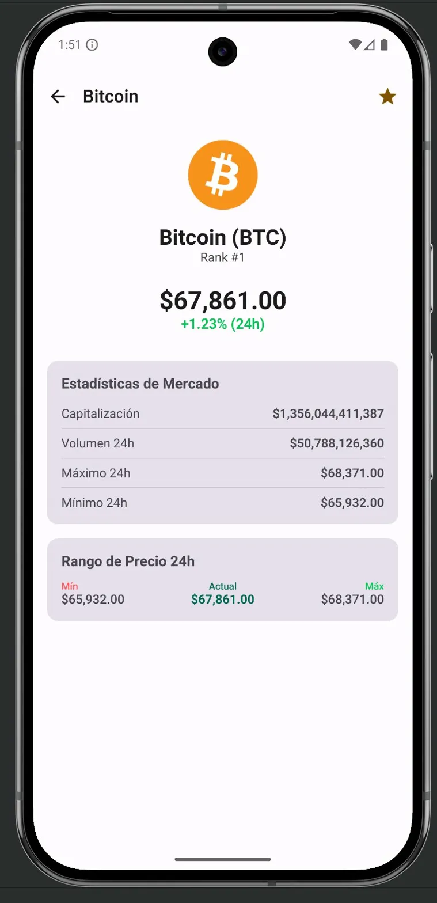
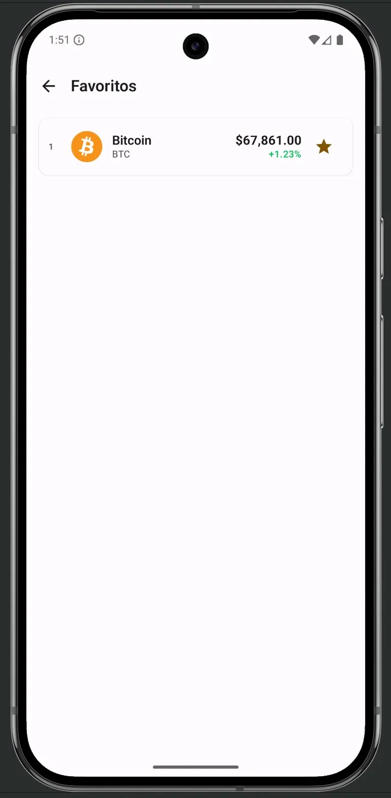
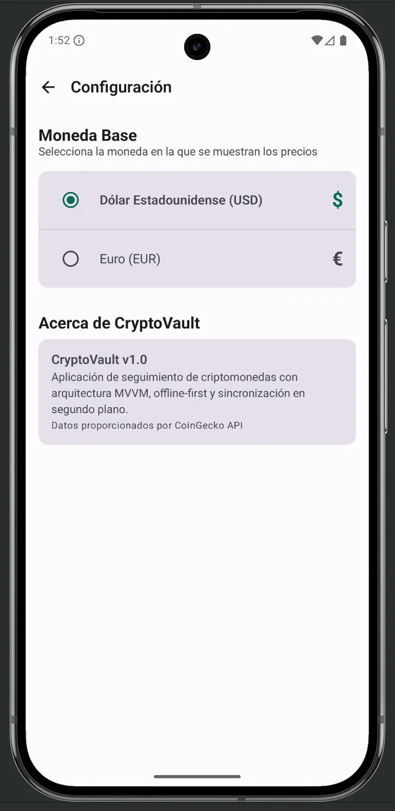

# CryptoVault

Aplicación Android nativa para el seguimiento en tiempo real de las 50 principales criptomonedas del mercado. Desarrollada en **Kotlin** con **Jetpack Compose**, arquitectura **MVVM** y enfoque **offline-first**.

<p align="center">
  
  
  
  
</p>

---

## Características

- **Top 50 criptomonedas** con precio, variación 24h y ranking en tiempo real
- **Pantalla de detalle** con estadísticas de mercado (capitalización, volumen, rango 24h)
- **Sistema de favoritos** con persistencia local
- **Buscador** con filtrado instantáneo por nombre o símbolo
- **Cambio de moneda base** entre USD y EUR (se aplica globalmente)
- **Sincronización en segundo plano** automática con WorkManager (cada 30 minutos)
- **Modo offline-first**: los datos se cachean en Room y funcionan sin conexión
- **Indicador de estado del mercado** implementado con Views clásicas (XML) integrado en Compose

---

## Arquitectura

El proyecto sigue **Clean Architecture** con separación en tres capas y el patrón **MVVM** con flujo de datos unidireccional (UDF):

```
com.cryptovault/
├── data/                        # Capa de datos
│   ├── local/
│   │   ├── dao/                 # CryptoDao (consultas Room)
│   │   ├── entity/              # CryptoEntity (tabla Room)
│   │   ├── datastore/           # PreferencesManager (DataStore)
│   │   └── CryptoDatabase.kt   # Base de datos Room
│   ├── remote/
│   │   ├── api/                 # CoinGeckoApi (interfaz Retrofit)
│   │   ├── dto/                 # CoinDto (modelo de la API)
│   │   └── RetrofitClient.kt   # Configuración HTTP
│   └── repository/
│       └── CryptoRepositoryImpl.kt  # Implementación del repositorio
│
├── domain/                      # Capa de dominio
│   ├── model/
│   │   └── Crypto.kt           # Modelo de dominio (UI-ready)
│   └── repository/
│       ├── CryptoRepository.kt      # Interfaz del repositorio
│       └── CurrencyPreferences.kt   # Interfaz de preferencias
│
├── ui/                          # Capa de presentación
│   ├── screens/
│   │   ├── home/                # HomeScreen + HomeViewModel
│   │   ├── detail/              # DetailScreen + DetailViewModel
│   │   ├── favorites/           # FavoritesScreen + FavoritesViewModel
│   │   └── settings/            # SettingsScreen + SettingsViewModel
│   ├── components/
│   │   └── CryptoListItem.kt   # Componente reutilizable
│   ├── legacy/
│   │   └── MarketStatusBanner.kt  # View clásica (XML) en Compose
│   ├── navigation/
│   │   └── NavGraph.kt         # Navegación con Navigation Compose
│   └── theme/                   # Material 3 theming
│
├── di/
│   └── AppContainer.kt         # Inyección de dependencias manual
│
├── worker/
│   └── SyncPricesWorker.kt     # Worker de sincronización periódica
│
├── CryptoVaultApp.kt           # Application class
└── MainActivity.kt             # Entry point
```

### Flujo de datos

```
CoinGecko API  →  Retrofit  →  Repository  →  Room (caché)
                                                    ↓
                                              Flow<List<Crypto>>
                                                    ↓
                                              ViewModel (StateFlow)
                                                    ↓
                                              Compose UI (collectAsState)
```

---

## Stack tecnológico

| Componente | Tecnología |
|---|---|
| Lenguaje | Kotlin |
| UI | Jetpack Compose + Material 3 |
| Arquitectura | MVVM + Clean Architecture + UDF |
| Base de datos local | Room (con KSP) |
| API REST | Retrofit + Gson + OkHttp |
| Preferencias | DataStore Preferences |
| Tareas en segundo plano | WorkManager |
| Navegación | Navigation Compose |
| Carga de imágenes | Coil |
| Testing | JUnit 4 + Coroutines Test + Turbine |
| Views clásicas | ViewBinding + AndroidView interop |

---

## API

La app consume la API pública de [CoinGecko](https://www.coingecko.com/en/api) (sin API key):

```
GET /api/v3/coins/markets
    ?vs_currency=usd
    &order=market_cap_desc
    &per_page=50
    &page=1
    &sparkline=false
```

---

## Requisitos

- **Android Studio** Ladybug (2024.2.1) o superior
- **JDK 17**
- **Android SDK 35** (compileSdk)
- **Dispositivo/Emulador** con API 26+ (Android 8.0 Oreo)

---

## Instalación

1. **Clona el repositorio:**
   ```bash
   git clone https://github.com/TU_USUARIO/CryptoVault.git
   ```

2. **Abre en Android Studio:**
   - File → Open → selecciona la carpeta `CryptoVault`

3. **Sincroniza Gradle:**
   - Android Studio descargará automáticamente las dependencias

4. **Ejecuta la app:**
   - Selecciona un emulador o dispositivo físico
   - Pulsa ▶ Run

---

## Tests

El proyecto incluye tests unitarios del `HomeViewModel` usando Fakes (test doubles):

```bash
./gradlew testDebugUnitTest
```

Los tests verifican: estado inicial, refresh exitoso/fallido, emisión de datos desde el repositorio, búsqueda y limpieza de errores.

---

## Estructura de los tests

```
src/test/java/com/cryptovault/
└── HomeViewModelTest.kt    # 6 tests unitarios
    ├── FakeCryptoRepository    # Fake del repositorio (sin red ni BD)
    └── FakeCurrencyPreferences # Fake del DataStore
```

---

## Licencia

Este proyecto se ha desarrollado con fines académicos.
